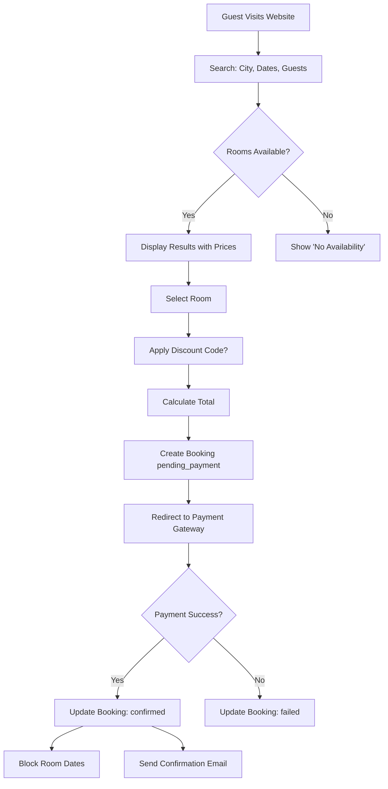

# Hotel Booking System - Database Documentation
## A Student-Friendly Guide to Entity Relationships & Lifecycles

---

## 📚 Table of Contents
1. [Introduction](#introduction)
2. [Core Concepts](#core-concepts)
3. [Entity Relationship Diagram (ERD)](#entity-relationship-diagram)
4. [Detailed Entity Descriptions](#detailed-entity-descriptions)
5. [Relationship Types Explained](#relationship-types-explained)
6. [Complete Lifecycle Scenarios](#complete-lifecycle-scenarios)
7. [Data Flow Examples](#data-flow-examples)
8. [Common Use Cases](#common-use-cases)
9. [Best Practices](#best-practices)

---

## 🎯 Introduction

### What is this System?
This is a **Hotel Booking Management System** - a comprehensive database that manages:
- Multiple hotels and their rooms
- Guest registrations and bookings
- Payments and pricing
- Reviews and ratings
- Administrative controls

### Who uses it?
- **Guests**: Browse hotels, make bookings, write reviews
- **Hotel Administrators**: Manage rooms, pricing, bookings
- **Super Administrators**: Oversee all hotels in the system
- **System**: Automated processes for availability, pricing, notifications

---

## 🧠 Core Concepts

### 1. What is an Entity?
An **entity** is a real-world object or concept that we want to store information about.

**Example**: A `Guest` is an entity that represents a person who books a hotel room.

### 2. What is a Relationship?
A **relationship** shows how two entities are connected.

**Example**: A `Guest` **makes** a `Booking` → This is a relationship.

### 3. Cardinality (How Many?)

| Notation | Meaning | Example |
|----------|---------|---------|
| **1:1** (One-to-One) | One record relates to exactly one other record | One booking → One review |
| **1:N** (One-to-Many) | One record relates to many records | One hotel → Many rooms |
| **N:M** (Many-to-Many) | Many records relate to many records | Many bookings → Many rooms (via junction table) |

---

## 🗺️ Entity Relationship Diagram

```
┌─────────────────────────────────────────────────────────────────────┐
│                        HOTEL BOOKING SYSTEM                          │
└─────────────────────────────────────────────────────────────────────┘

┌──────────────┐       ┌──────────────┐       ┌──────────────┐
│   HOTELS     │──────<│  ROOM_TYPES  │──────<│    ROOMS     │
│              │   1:N │              │   1:N │              │
│  - id        │       │  - id        │       │  - id        │
│  - name      │       │  - hotel_id  │       │  - room_type │
│  - city      │       │  - name      │       │  - number    │
│  - rating    │       │  - max_occ   │       │  - status    │
└──────┬───────┘       └──────┬───────┘       └──────┬───────┘
       │                      │                      │
       │                      │                      │
       │              ┌───────┴──────┐               │
       │              │   TARIFFS    │               │
       │              │              │               │
       │              │  - id        │               │
       │              │  - price     │               │
       │              │  - dates     │               │
       │              └──────────────┘               │
       │                                             │
       │                                             │
       │              ┌──────────────┐               │
       └─────────────>│   BOOKINGS   │<──────────────┘
                1:N   │              │    N:M
                      │  - id        │  (via booking_rooms)
    ┌────────────────>│  - guest_id  │
    │            1:N  │  - hotel_id  │
    │                 │  - dates     │
┌───┴──────┐          │  - status    │
│  GUESTS  │          └──────┬───────┘
│          │                 │
│  - id    │                 │ 1:N
│  - name  │          ┌──────┴────────┐
│  - email │          │   PAYMENTS    │
└──────────┘          │               │
                      │  - booking_id │
                      │  - amount     │
                      │  - status     │
                      └───────────────┘
```

---

## 📋 Detailed Entity Descriptions

### 1. 🏨 Hotels
**Purpose**: Represents physical hotel properties in the system.

**Key Fields**:
- `id`: Unique identifier
- `name`: Hotel name (e.g., "Grand Plaza Hotel")
- `city`, `country`: Location information
- `star_rating`: Quality rating (1-5 stars)
- `is_active`: Whether hotel is currently operational

**Real-world Example**:
```
Hotel: "Taj Mahal Palace"
City: "Mumbai"
Star Rating: 5
Status: Active
```

**Relationships**:
- Has many → Room Types
- Has many → Rooms
- Has many → Tariffs
- Has many → Bookings
- Has many → Administrators (hotel-level)

---

### 2. 🛏️ Room Types
**Purpose**: Categories of rooms a hotel offers (like product categories).

**Why Separate from Rooms?**
- Same type of room exists multiple times (10 Deluxe Suites)
- Pricing applies to the TYPE, not individual rooms
- Easier to manage common properties

**Key Fields**:
- `id`: Unique identifier
- `hotel_id`: Which hotel owns this type
- `name`: "Deluxe Suite", "Standard Room"
- `max_occupancy`: How many people can stay
- `bed_type`: "King", "Queen", "Double"
- `amenities`: "WiFi, TV, Mini-bar, Balcony"

**Real-world Example**:
```
Room Type: "Ocean View Suite"
Hotel: Seaside Resort
Max Occupancy: 4 people
Bed: King Size
Amenities: Ocean view, balcony, jacuzzi
```

**Relationships**:
- Belongs to → One Hotel
- Has many → Rooms (actual physical rooms)
- Has many → Tariffs (pricing over time)

---

### 3. 🚪 Rooms
**Purpose**: Individual physical rooms within a hotel.

**Key Fields**:
- `id`: Unique identifier
- `hotel_id`: Which hotel
- `room_type_id`: What type of room
- `room_number`: "501", "A12"
- `floor`: "5", "Ground"
- `status`: available, occupied, maintenance, blocked

**Real-world Example**:
```
Room Number: 501
Type: Deluxe Suite
Floor: 5
Status: Available
Notes: "Recently renovated"
```

**Status Lifecycle**:
```
available → occupied → available
    ↓                      ↑
maintenance → repair → available
```

**Relationships**:
- Belongs to → One Hotel
- Belongs to → One Room Type
- Has many → Booking Rooms (booking history)
- Has many → Maintenance Logs

---

### 4. 💰 Tariffs
**Purpose**: Pricing rules for room types over different time periods.

**Why Complex Pricing?**
- Hotels charge differently during peak/off-peak seasons
- Weekends vs. weekdays pricing
- Holiday surcharges

**Key Fields**:
- `id`: Unique identifier
- `room_type_id`: Which room type
- `price`: Amount (e.g., 350.00)
- `currency`: "USD", "INR"
- `start_date`: When this price starts
- `end_date`: When this price ends
- `is_weekend`: Special weekend pricing

**Real-world Example**:
```
Room Type: Deluxe Suite
Regular Season (Jan-Jun): $350/night
Peak Season (Jul-Aug): $450/night
Weekend Surcharge: +$50/night
```

**Relationships**:
- Belongs to → One Room Type
- Referenced by → Booking Rooms (frozen price)

---

### 5. 👤 Guests
**Purpose**: People who book hotel rooms.

**Key Fields**:
- `id`: Unique identifier
- `first_name`, `last_name`: Full name
- `email`: Unique email (login credential)
- `phone`: Contact number
- `date_of_birth`: For age verification
- `id_proof_type`, `id_proof_number`: For security

**Real-world Example**:
```
Guest: Alice Johnson
Email: alice.j@email.com
Phone: +1-555-1001
Member Since: 2025-01-15
Total Bookings: 5
```

**Relationships**:
- Has many → Bookings
- Has many → Reviews
- Has one → Guest Preferences
- Has one → Notification Preferences

---

### 6. 📅 Bookings
**Purpose**: A reservation made by a guest for hotel stay.

**Key Fields**:
- `id`: Unique booking reference
- `guest_id`: Who made the booking
- `hotel_id`: Which hotel
- `check_in_date`, `check_out_date`: Stay duration
- `status`: confirmed, checked_in, checked_out, cancelled
- `total_amount`: Before discounts
- `discount_amount`: Savings
- `final_amount`: What guest pays

**Status Values**:
1. `pending_payment`: Just created, awaiting payment
2. `confirmed`: Payment received
3. `checked_in`: Guest arrived
4. `checked_out`: Guest left
5. `cancelled`: Booking cancelled
6. `no_show`: Guest didn't arrive

**Real-world Example**:
```
Booking ID: BK-12345
Guest: Alice Johnson
Hotel: Grand Plaza
Check-in: Feb 15, 2026
Check-out: Feb 20, 2026
Rooms: Room 501 (Deluxe Suite)
Nights: 5
Total: $1,750
Discount: $175 (10% off)
Final Amount: $1,575
Status: Confirmed
```

**Relationships**:
- Belongs to → One Guest
- Belongs to → One Hotel
- Has many → Booking Rooms (actual rooms booked)
- Has many → Payments
- Has one → Review
- Has many → Status History (audit trail)

---

### 7. 🔗 Booking Rooms (Junction Table)
**Purpose**: Links bookings to specific rooms (solves many-to-many relationship).

**Why This Table?**
- A booking can have multiple rooms (family trip)
- A room can have many bookings over time
- Need to store the **frozen price** at booking time

**Key Fields**:
- `booking_id`: Which booking
- `room_id`: Which room
- `check_in_date`, `check_out_date`: Stay dates (denormalized)
- `price_per_night`: Frozen price (won't change if tariff updates)
- `number_of_nights`: Duration
- `total_price`: price_per_night × number_of_nights
- `tariff_id`: Which pricing rule was used

**Real-world Example**:
```
Booking: BK-12345
Room: 501 (Deluxe Suite)
Dates: Feb 15-20, 2026
Price Per Night: $350 (frozen)
Nights: 5
Total: $1,750
Tariff Used: Regular Season Rate
```

**Why Freeze Prices?**
If a guest books 6 months in advance and the hotel raises prices later, the guest still pays the original price!

---

### 8. 💳 Payments
**Purpose**: Track financial transactions for bookings.

**Key Fields**:
- `booking_id`: Which booking this payment is for
- `amount`: Payment amount
- `payment_method`: credit_card, debit_card, online_wallet
- `transaction_id`: Gateway reference (unique)
- `status`: pending, processing, paid, failed, refunded
- `gateway_name`: "Stripe", "PayPal", "Razorpay"
- `refund_id`: Links to original payment if this is a refund

**Payment Flow**:
```
1. Guest clicks "Pay Now"
2. Status: pending
3. Redirected to payment gateway
4. Status: processing
5. Gateway confirms → Status: paid
6. If declined → Status: failed
```

**Refund Flow**:
```
1. Booking cancelled
2. Create new payment record (negative amount)
3. Link to original payment via refund_id
4. Update original payment status: partially_refunded or refunded
```

**Real-world Example**:
```
Payment ID: PAY-789
Booking: BK-12345
Amount: $1,575
Method: Credit Card
Transaction ID: txn_stripe_abc123
Status: Paid
Gateway: Stripe
Date: Feb 1, 2026
```

---

### 9. 🎁 Discounts
**Purpose**: Promotional codes that reduce booking costs.

**Key Fields**:
- `code`: "WELCOME10", "SUMMER50" (unique)
- `amount`: Discount value
- `amount_type`: "percentage" (10%) or "fixed" ($50)
- `valid_from`, `valid_to`: When code is active
- `usage_limit`: Max times code can be used
- `usage_count`: How many times used
- `min_booking_amount`: Minimum spend to qualify

**Real-world Example**:
```
Code: WELCOME10
Description: "10% off for new customers"
Type: Percentage
Amount: 10%
Valid: Jan 1 - Dec 31, 2026
Usage Limit: 1000
Times Used: 234
Min Booking: $100
Max Discount: $200 (cap)
```

**Calculation Example**:
```
Original Booking: $1,750
Discount Code: WELCOME10 (10%)
Discount Amount: $175
Final Amount: $1,575
```

---

### 10. ⭐ Reviews
**Purpose**: Guest feedback after completed stays.

**Key Fields**:
- `booking_id`: Which stay (unique - one review per booking)
- `guest_id`: Who wrote it
- `hotel_id`: Which hotel
- `rating`: Overall rating (1-5)
- `cleanliness_rating`: Room cleanliness (1-5)
- `service_rating`: Staff service (1-5)
- `location_rating`: Hotel location (1-5)
- `value_rating`: Price vs. quality (1-5)
- `title`, `comment`: Review text
- `response`: Hotel's reply
- `response_by`: Which admin replied
- `is_verified`: Guest actually stayed
- `helpful_count`: How many found review useful

**Real-world Example**:
```
Booking: BK-12345
Guest: Alice Johnson
Hotel: Grand Plaza
Overall Rating: 5/5
Cleanliness: 5/5
Service: 4/5
Location: 5/5
Value: 4/5

Title: "Excellent Stay!"
Comment: "Room was spotless, staff very friendly. Great location!"
Date: Feb 21, 2026

Hotel Response:
"Thank you Alice! We're thrilled you enjoyed your stay. 
Looking forward to welcoming you again!"
```

---

### 11. 👔 Administrators
**Purpose**: Staff who manage the system.

**Roles**:
1. **Super Admin**: Manages all hotels, full system access
2. **Hotel Admin**: Manages one specific hotel
3. **Manager**: Handles bookings, guest queries
4. **Staff**: View-only access

**Key Fields**:
- `username`, `password_hash`: Login credentials
- `email`: Contact email (unique)
- `role`: super_admin, hotel_admin, manager, staff
- `hotel_id`: NULL for super admin, specific hotel ID for others
- `permissions`: JSON array of allowed actions

**Real-world Example**:
```
Username: john.smith
Role: Hotel Admin
Hotel: Grand Plaza Hotel
Permissions: [
  "view_bookings",
  "edit_bookings",
  "manage_rooms",
  "view_reports",
  "respond_reviews"
]
```

---

## 🔄 Relationship Types Explained

### 1. One-to-Many (1:N) - Most Common

**Example 1: Hotels → Rooms**
```
One Hotel can have Many Rooms
One Room belongs to exactly One Hotel

Grand Plaza Hotel
├── Room 501
├── Room 502
├── Room 503
└── Room 504
```

**Implementation**:
```sql
CREATE TABLE rooms (
    id VARCHAR(36) PRIMARY KEY,
    hotel_id VARCHAR(36),  -- Foreign key
    room_number VARCHAR(20),
    FOREIGN KEY (hotel_id) REFERENCES hotels(id)
);
```

**Example 2: Guests → Bookings**
```
One Guest can make Many Bookings
One Booking belongs to One Guest

Alice Johnson (Guest)
├── Booking Jan 2026 (New York)
├── Booking Mar 2026 (Miami)
└── Booking Jul 2026 (Denver)
```

---

### 2. Many-to-Many (N:M) - Requires Junction Table

**Example: Bookings ↔ Rooms**

**Problem**: 
- A booking can include multiple rooms (family trip)
- A room can be in many bookings (over time)

**Solution**: Create `booking_rooms` junction table

```
Booking BK-001 (Family Trip)
├── Room 501 ($350/night)
├── Room 502 ($350/night)
└── Room 301 ($200/night)

Room 501
├── Booking BK-001 (Feb 15-20)
├── Booking BK-045 (Mar 10-12)
└── Booking BK-089 (Apr 5-8)
```

**Implementation**:
```sql
CREATE TABLE booking_rooms (
    id VARCHAR(36) PRIMARY KEY,
    booking_id VARCHAR(36),  -- FK to bookings
    room_id VARCHAR(36),     -- FK to rooms
    price_per_night DECIMAL(10,2),
    FOREIGN KEY (booking_id) REFERENCES bookings(id),
    FOREIGN KEY (room_id) REFERENCES rooms(id)
);
```

---

### 3. One-to-One (1:1) - Rare

**Example: Bookings → Reviews**
```
One Booking can have One Review
One Review belongs to One Booking

Booking BK-12345
└── Review: "Excellent stay! 5 stars"
```

**Implementation**:
```sql
CREATE TABLE reviews (
    id VARCHAR(36) PRIMARY KEY,
    booking_id VARCHAR(36) UNIQUE,  -- UNIQUE makes it 1:1
    rating INT,
    FOREIGN KEY (booking_id) REFERENCES bookings(id)
);
```

---

## 🎬 Complete Lifecycle Scenarios

### Scenario 1: New Guest Books a Room 🆕

```
┌─────────────────────────────────────────────────────────────┐
│  SCENARIO: First-Time Guest Makes a Booking                 │
└─────────────────────────────────────────────────────────────┘

STEP 1: Guest Registration
──────────────────────────
➤ Guest visits website
➤ Fills registration form

SQL:
INSERT INTO guests (id, first_name, last_name, email, phone)
VALUES ('g100', 'Sarah', 'Williams', 'sarah.w@email.com', '+1-555-2001');

INSERT INTO guest_preferences (id, guest_id, bed_preference)
VALUES ('gp100', 'g100', 'King Size');

Result: Guest account created ✅


STEP 2: Search for Hotels
──────────────────────────
➤ Guest searches: "New York hotels, Feb 15-20, 2 guests"
➤ System checks availability

SQL:
SELECT h.name, rt.name, t.price
FROM hotels h
JOIN room_types rt ON h.id = rt.hotel_id
JOIN tariffs t ON rt.id = t.room_type_id
WHERE h.city = 'New York'
  AND '2026-02-15' BETWEEN t.start_date AND t.end_date
  AND NOT EXISTS (
    -- Check room is not already booked
    SELECT 1 FROM booking_rooms br
    WHERE br.room_id = r.id
      AND NOT (br.check_out_date <= '2026-02-15' 
           OR br.check_in_date >= '2026-02-20')
  );

Result: Shows "Grand Plaza Hotel - Deluxe Suite - $350/night" ✅


STEP 3: Create Booking
──────────────────────
➤ Guest selects room, clicks "Book Now"
➤ System calculates total

Calculation:
- Nights: 5 (Feb 15-20)
- Price per night: $350
- Subtotal: $1,750
- Discount (WELCOME10): -$175 (10%)
- Final Amount: $1,575

SQL:
INSERT INTO bookings (
  id, guest_id, hotel_id, check_in_date, check_out_date,
  total_amount, discount_amount, final_amount, status
) VALUES (
  'b100', 'g100', 'h1', '2026-02-15', '2026-02-20',
  1750.00, 175.00, 1575.00, 'pending_payment'
);

INSERT INTO booking_rooms (
  id, booking_id, room_id, check_in_date, check_out_date,
  price_per_night, number_of_nights, total_price, tariff_id
) VALUES (
  'br100', 'b100', 'r1', '2026-02-15', '2026-02-20',
  350.00, 5, 1750.00, 't1'
);

Result: Booking created, status = pending_payment ✅


STEP 4: Payment Processing
──────────────────────────
➤ Guest enters credit card details
➤ Redirected to Stripe payment gateway

SQL:
INSERT INTO payments (
  id, booking_id, amount, payment_method, 
  transaction_id, status, gateway_name
) VALUES (
  'p100', 'b100', 1575.00, 'credit_card',
  'txn_stripe_abc789', 'processing', 'Stripe'
);

➤ Payment gateway processes...
➤ Success response received

UPDATE payments
SET status = 'paid', payment_date = NOW()
WHERE id = 'p100';

UPDATE bookings
SET status = 'confirmed'
WHERE id = 'b100';

Result: Payment successful, booking confirmed! ✅


STEP 5: Update Room Availability
────────────────────────────────
➤ System blocks room for these dates

SQL:
INSERT INTO room_availability_calendar 
  (id, room_id, date, is_available, blocked_reason, booking_room_id)
SELECT 
  UUID(), 'r1', date_seq, FALSE, 'booking', 'br100'
FROM (
  SELECT DATE_ADD('2026-02-15', INTERVAL n DAY) as date_seq
  FROM generate_series(0, 4) n  -- Days 0-4 = 5 nights
) dates;

Result: Room 501 blocked Feb 15-19 ✅


STEP 6: Send Confirmation
─────────────────────────
➤ System sends email to sarah.w@email.com

Email Content:
"Dear Sarah,
Your booking is confirmed!
Booking ID: b100
Hotel: Grand Plaza Hotel
Check-in: Feb 15, 2026
Check-out: Feb 20, 2026
Room: 501 (Deluxe Suite)
Total Paid: $1,575
Thank you!"

Result: Customer notified ✅
```

---

### Scenario 2: Guest Checks In 🏨

```
┌─────────────────────────────────────────────────────────────┐
│  SCENARIO: Guest Arrives at Hotel                           │
└─────────────────────────────────────────────────────────────┘

DATE: February 15, 2026 (Check-in day)

STEP 1: Front Desk Lookup
─────────────────────────
➤ Guest arrives, provides booking ID or email
➤ Staff searches system

SQL:
SELECT 
  b.id, b.check_in_date, b.status,
  g.first_name, g.last_name,
  r.room_number, rt.name AS room_type
FROM bookings b
JOIN guests g ON b.guest_id = g.id
JOIN booking_rooms br ON b.id = br.booking_id
JOIN rooms r ON br.room_id = r.id
JOIN room_types rt ON r.room_type_id = rt.id
WHERE g.email = 'sarah.w@email.com'
  AND b.check_in_date = CURDATE()
  AND b.status = 'confirmed';

Result: Found booking b100 for Sarah Williams, Room 501 ✅


STEP 2: Verify ID and Payment
─────────────────────────────
➤ Staff checks government ID
➤ Verifies payment status

SQL:
SELECT status, amount
FROM payments
WHERE booking_id = 'b100';

Result: Payment confirmed: $1,575 paid ✅


STEP 3: Update Booking Status
─────────────────────────────
➤ Staff clicks "Check In" button

SQL:
-- Update booking status
UPDATE bookings
SET status = 'checked_in', updated_at = NOW()
WHERE id = 'b100';

-- Log status change (audit trail)
INSERT INTO booking_status_history (
  id, booking_id, old_status, new_status, changed_by
) VALUES (
  UUID(), 'b100', 'confirmed', 'checked_in', 'admin2'
);

Result: Booking status = checked_in ✅


STEP 4: Update Room Status
──────────────────────────
➤ Mark room as occupied

SQL:
UPDATE rooms
SET status = 'occupied', updated_at = NOW()
WHERE id = 'r1';

Result: Room 501 now occupied ✅


STEP 5: Generate Key Card
─────────────────────────
➤ System programs room key for Sarah
➤ Access granted for Feb 15-20

Result: Key card handed to guest ✅


STEP 6: Send Welcome Message
────────────────────────────
SMS/Email:
"Welcome to Grand Plaza Hotel, Sarah!
Your room: 501 (5th floor)
WiFi: GrandPlaza_Guest
Password: welcome2026
Checkout: Feb 20 by 11 AM
Enjoy your stay!"

Result: Guest welcomed ✅
```

---

### Scenario 3: Guest Checks Out & Reviews Stay ⭐

```
┌─────────────────────────────────────────────────────────────┐
│  SCENARIO: Guest Completes Stay and Leaves Review           │
└─────────────────────────────────────────────────────────────┘

DATE: February 20, 2026 (Check-out day)

STEP 1: Check-Out Process
─────────────────────────
➤ Guest returns to front desk
➤ Staff processes checkout

SQL:
-- Update booking
UPDATE bookings
SET status = 'checked_out', updated_at = NOW()
WHERE id = 'b100';

-- Update room
UPDATE rooms
SET status = 'available', updated_at = NOW()
WHERE id = 'r1';

-- Log status change
INSERT INTO booking_status_history (
  id, booking_id, old_status, new_status, changed_by
) VALUES (
  UUID(), 'b100', 'checked_in', 'checked_out', 'admin2'
);

Result: Checkout complete ✅


STEP 2: Update Availability Calendar
────────────────────────────────────
➤ System marks past dates as available again

SQL:
UPDATE room_availability_calendar
SET is_available = TRUE, blocked_reason = NULL
WHERE room_id = 'r1'
  AND date < CURDATE();

Result: Room 501 ready for next guest ✅


STEP 3: Send Review Request Email
─────────────────────────────────
➤ System sends email after 24 hours

Email:
"Hi Sarah,
Thank you for staying at Grand Plaza Hotel!
How was your experience?
[Leave a Review Button]"

Result: Review invitation sent ✅


STEP 4: Guest Writes Review
───────────────────────────
➤ Sarah clicks link, fills review form

SQL:
INSERT INTO reviews (
  id, booking_id, guest_id, hotel_id, room_type_id,
  rating, cleanliness_rating, service_rating, 
  location_rating, value_rating, title, comment, is_verified
) VALUES (
  'r100', 'b100', 'g100', 'h1', 'rt1',
  5, 5, 4, 5, 4,
  'Excellent Stay!',
  'Room was spotless and staff was very friendly. Great location in Manhattan!',
  TRUE
);

Result: Review submitted ✅


STEP 5: Hotel Admin Responds
────────────────────────────
➤ Hotel staff sees new review notification
➤ Admin writes response

SQL:
UPDATE reviews
SET response = 'Thank you Sarah! We appreciate your kind words. Looking forward to welcoming you again!',
    response_by = 'admin2',
    response_date = NOW()
WHERE id = 'r100';

Result: Response posted ✅


STEP 6: Update Hotel Ratings
────────────────────────────
➤ System recalculates average ratings

SQL:
SELECT 
  AVG(rating) AS avg_rating,
  COUNT(*) AS total_reviews
FROM reviews
WHERE hotel_id = 'h1' AND is_approved = TRUE;

Result: Grand Plaza now has avg 4.8/5 stars (124 reviews) ✅
```

---

### Scenario 4: Guest Cancels Booking 🚫

```
┌─────────────────────────────────────────────────────────────┐
│  SCENARIO: Guest Cancels and Gets Refund                    │
└─────────────────────────────────────────────────────────────┘

DATE: February 10, 2026 (5 days before check-in)

STEP 1: Guest Requests Cancellation
───────────────────────────────────
➤ Guest calls or clicks "Cancel Booking"
➤ System checks cancellation policy

Policy: Full refund if cancelled 3+ days before check-in

SQL:
SELECT 
  b.id, b.check_in_date, b.final_amount,
  DATEDIFF(b.check_in_date, CURDATE()) AS days_until_checkin
FROM bookings b
WHERE b.id = 'b100';

Result: 5 days until check-in → Full refund eligible ✅


STEP 2: Admin Confirms Cancellation
───────────────────────────────────
➤ Admin processes cancellation

SQL:
UPDATE bookings
SET status = 'cancelled',
    cancelled_at = NOW(),
    cancelled_by = 'admin2',
    cancellation_reason = 'Guest requested - full refund'
WHERE id = 'b100';

Result: Booking cancelled ✅


STEP 3: Process Refund
──────────────────────
➤ System initiates refund through payment gateway

Refund Amount: $1,575 (100%)

SQL:
-- Create refund payment record
INSERT INTO payments (
  id, booking_id, amount, payment_method,
  transaction_id, status, refund_id, gateway_name
) VALUES (
  'p101', 'b100', 1575.00, 'credit_card',
  'refund_stripe_xyz123', 'refunded', 'p100', 'Stripe'
);

-- Update original payment
UPDATE payments
SET status = 'refunded',
    refund_amount = 1575.00,
    refund_date = NOW()
WHERE id = 'p100';

Result: Refund processed ✅


STEP 4: Free Up Room
────────────────────
➤ Clear availability calendar

SQL:
DELETE FROM room_availability_calendar
WHERE booking_room_id = 'br100';

UPDATE rooms
SET status = 'available'
WHERE id = 'r1';

Result: Room 501 available again ✅


STEP 5: Update Discount Usage
─────────────────────────────
➤ Since booking cancelled, free up discount code

SQL:
UPDATE discounts
SET usage_count = usage_count - 1
WHERE id = (SELECT discount_id FROM bookings WHERE id = 'b100');

Result: WELCOME10 code available again ✅


STEP 6: Notify Guest
────────────────────
Email:
"Hi Sarah,
Your booking (b100) has been cancelled.
Refund Amount: $1,575
Refund Method: Original credit card
Processing Time: 5-7 business days
We hope to serve you in the future!"

Result: Guest notified of cancellation ✅
```

---

### Scenario 5: Dynamic Pricing Based on Occupancy 📈

```
┌─────────────────────────────────────────────────────────────┐
│  SCENARIO: Automatic Price Adjustment                       │
└─────────────────────────────────────────────────────────────┘

STEP 1: System Monitors Occupancy
─────────────────────────────────
➤ Scheduled job runs daily at midnight
➤ Calculates occupancy rate

SQL:
SELECT 
  rt.id,
  rt.name,
  COUNT(r.id) AS total_rooms,
  SUM(CASE WHEN r.status = 'occupied' THEN 1 ELSE 0 END) AS occupied,
  ROUND((SUM(CASE WHEN r.status = 'occupied' THEN 1 ELSE 0 END) / COUNT(*) * 100), 2) AS occupancy_rate
FROM room_types rt
JOIN rooms r ON rt.id = r.room_type_id
WHERE rt.hotel_id = 'h1'
GROUP BY rt.id;

Result:
Deluxe Suite: 85% occupancy (High demand!)
Standard Room: 45% occupancy (Low demand)


STEP 2: Apply Dynamic Pricing
─────────────────────────────
➤ System adjusts prices based on demand

Pricing Rules:
- Occupancy > 80%: Increase price by 30%
- Occupancy > 60%: Increase price by 15%
- Occupancy < 30%: Decrease price by 15%

SQL:
INSERT INTO tariffs (
  id, room_type_id, price, start_date, end_date, description
)
SELECT 
  UUID(),
  'rt1',  -- Deluxe Suite
  350.00 * 1.30,  -- $455 (30% increase)
  CURDATE(),
  DATE_ADD(CURDATE(), INTERVAL 7 DAY),
  'High demand pricing - 85% occupancy'
WHERE (SELECT COUNT(*) FROM rooms r 
       WHERE r.room_type_id = 'rt1' AND r.status = 'occupied') / 
      (SELECT COUNT(*) FROM rooms WHERE room_type_id = 'rt1') > 0.80;

Result: Deluxe Suite now $455/night (was $350) ✅
```

---

### Scenario 6: Room Maintenance Workflow 🔧

```
┌─────────────────────────────────────────────────────────────┐
│  SCENARIO: Room Needs Repair                                │
└─────────────────────────────────────────────────────────────┘

STEP 1: Issue Reported
──────────────────────
➤ Housekeeping finds broken AC in Room 501
➤ Reports to manager

SQL:
INSERT INTO room_maintenance_log (
  id, room_id, maintenance_type, start_date,
  description, status, created_by
) VALUES (
  UUID(), 'r1', 'repair', NOW(),
  'AC unit not cooling - needs technician',
  'scheduled', 'admin2'
);

Result: Maintenance ticket created ✅


STEP 2: Block Room
─────────────────
➤ System marks room as unavailable

SQL:
UPDATE rooms
SET status = 'maintenance', updated_at = NOW()
WHERE id = 'r1';

-- Block in calendar
INSERT INTO room_availability_calendar
  (id, room_id, date, is_available, blocked_reason)
SELECT UUID(), 'r1', CURDATE() + INTERVAL n DAY, FALSE, 'maintenance'
FROM generate_series(0, 2) n;  -- Block for 3 days

Result: Room 501 unavailable for booking ✅


STEP 3: Technician Repairs
─────────────────────────
➤ Technician fixes AC
➤ Manager updates ticket

SQL:
UPDATE room_maintenance_log
SET status = 'completed',
    end_date = NOW(),
    cost = 250.00,
    performed_by = 'TechCorp Services'
WHERE room_id = 'r1' AND status = 'scheduled';

Result: Repair completed ✅


STEP 4: Quality Check
─────────────────────
➤ Housekeeping verifies AC works
➤ Manager re-opens room

SQL:
UPDATE rooms
SET status = 'available',
    last_maintenance_date = NOW(),
    updated_at = NOW()
WHERE id = 'r1';

-- Clear calendar blocks
DELETE FROM room_availability_calendar
WHERE room_id = 'r1' 
  AND blocked_reason = 'maintenance'
  AND date >= CURDATE();

Result: Room 501 back in service ✅
```

---

## 📊 Data Flow Examples

### Flow 1: Guest Search → Booking → Payment



### Flow 2: Check-in → Stay → Check-out

```mermaid
graph LR
    A[Guest Arrives] --> B[Verify Booking]
    B --> C[Check ID]
    C --> D[Update: checked_in]
    D --> E[Issue Key Card]
    E --> F[Guest Stays]
    F --> G[Check-out Date]
    G --> H[Return Key]
    H --> I[Update: checked_out]
    I --> J[Free Room]
    J --> K[Send Review Request]
```



---

## 📖 Common Use Cases

### Use Case 1: Multi-Room Family Booking

**Scenario**: Family books 2 rooms for vacation

**Data Structure**:
```
1 Booking (b200)
├── Room 501 (Parents) - $350/night × 5 nights = $1,750
└── Room 502 (Kids) - $350/night × 5 nights = $1,750
Total: $3,500
Discount (FAMILY15): -$525 (15%)
Final: $2,975
```

**SQL**:
```sql
-- Single booking
INSERT INTO bookings VALUES ('b200', 'g100', 'h1', ..., 2975.00);

-- Two booking_rooms entries
INSERT INTO booking_rooms VALUES ('br201', 'b200', 'r1', ...);
INSERT INTO booking_rooms VALUES ('br202', 'b200', 'r2', ...);
```

---

### Use Case 2: Loyalty Program - Repeat Guest

**Scenario**: Track guest value over time

**Query**:
```sql
SELECT 
  g.first_name,
  COUNT(b.id) AS total_bookings,
  SUM(b.final_amount) AS lifetime_value,
  AVG(b.final_amount) AS avg_booking,
  CASE 
    WHEN COUNT(b.id) >= 10 THEN 'VIP'
    WHEN COUNT(b.id) >= 5 THEN 'Gold'
    ELSE 'Regular'
  END AS loyalty_tier
FROM guests g
JOIN bookings b ON g.id = b.guest_id
WHERE b.status IN ('checked_out', 'checked_in')
GROUP BY g.id;
```

**Result**:
```
Alice Johnson
Total Bookings: 8
Lifetime Value: $12,450
Avg Booking: $1,556
Tier: Gold
→ Eligible for 10% discount on next booking!
```

---

## 💡 Best Practices

### 1. Data Integrity

**Always use Foreign Keys**:
```sql
-- ✅ GOOD: Enforces relationships
FOREIGN KEY (hotel_id) REFERENCES hotels(id) ON DELETE CASCADE

-- ❌ BAD: No enforcement
hotel_id VARCHAR(36)
```

**Use Constraints**:
```sql
-- Ensure dates are logical
CHECK (check_out_date > check_in_date)

-- Ensure ratings are valid
CHECK (rating BETWEEN 1 AND 5)

-- Prevent duplicate room numbers per hotel
UNIQUE KEY (hotel_id, room_number)
```

---

### 2. Soft Deletes

**Never delete important records**:
```sql
-- ✅ GOOD: Soft delete
UPDATE bookings 
SET is_active = FALSE, deleted_at = NOW()
WHERE id = 'b100';

-- ❌ BAD: Hard delete (data loss!)
DELETE FROM bookings WHERE id = 'b100';
```

---

### 3. Audit Trails

**Track all changes**:
```sql
-- Log every status change
INSERT INTO booking_status_history 
  (booking_id, old_status, new_status, changed_by)
VALUES ('b100', 'confirmed', 'cancelled', 'admin2');
```

---

### 4. Price Freezing

**Lock prices at booking time**:
```sql
-- ✅ GOOD: Store price in booking_rooms
INSERT INTO booking_rooms 
  (booking_id, room_id, price_per_night, ...)
VALUES ('br100', 'r1', 350.00, ...);

-- Even if tariff changes to $450 tomorrow,
-- guest pays original $350!
```

---

### 5. Prevent Double Booking

**Check overlaps before confirming**:
```sql
-- Find conflicts
SELECT COUNT(*) 
FROM booking_rooms br
JOIN bookings b ON br.booking_id = b.id
WHERE br.room_id = 'r1'
  AND b.status NOT IN ('cancelled', 'no_show')
  AND NOT (
    br.check_out_date <= '2026-02-15' OR
    br.check_in_date >= '2026-02-20'
  );

-- If COUNT > 0, room is already booked!
```

---

### 6. Index Performance Fields

**Speed up common queries**:
```sql
CREATE INDEX idx_booking_dates ON bookings(check_in_date, check_out_date);
CREATE INDEX idx_room_availability ON room_availability_calendar(room_id, date);
CREATE INDEX idx_payment_status ON payments(booking_id, status);
```

---

## 🎓 Summary for Students

### Key Takeaways:

1. **Entities represent real-world objects** (Hotels, Guests, Bookings)

2. **Relationships connect entities** (Guest MAKES Booking)

3. **Junction tables solve many-to-many** (booking_rooms links bookings ↔ rooms)

4. **Foreign keys enforce integrity** (No orphaned records)

5. **Status fields track lifecycle** (pending → confirmed → checked_in → checked_out)

6. **Audit tables provide history** (Who changed what when)

7. **Denormalization helps performance** (Store check-in/out dates in booking_rooms)

8. **Price freezing protects customers** (Lock rates at booking time)

9. **Constraints prevent bad data** (CHECK, UNIQUE, NOT NULL)

10. **Think in flows, not just tables** (Guest journey from search to review)

---

## 🚀 Next Steps

1. **Study the ERD diagram** - Understand visual relationships
2. **Trace a booking lifecycle** - Follow the data flow
3. **Run sample queries** - See how JOINs work
4. **Design your own scenarios** - What happens if...?
5. **Practice SQL** - Write queries for each use case

---

**Happy Learning! 📚**
